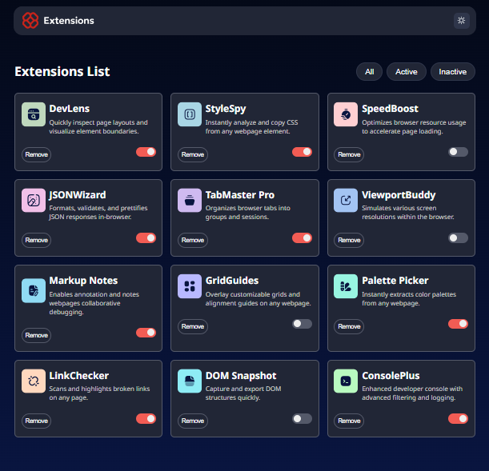
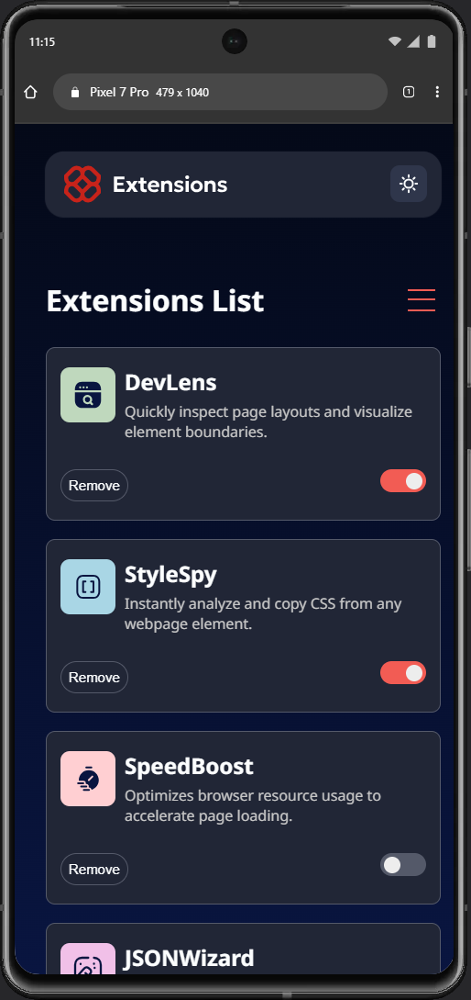

# 🌐 Projeto Extensões do Navegador

Aplicação web interativa que exibe uma lista de extensões de navegador, o projeto é uma proposta do [Frontend Mentor](https://www.frontendmentor.io/), projeto também conta com **modo escuro/claro (Dark/Light Mode)** e persistência de estado no **Local Storage**.

---

## 🚀 Funcionalidades

- ↔️ Alternar extensões entre estados ativos e inativos
    - Filtrar extensões entre ativas, inativas e *todas*
    - Remover extensões da lista ativos / inativos
    - Alternância de Tema *(dark-mode)*
- 🧩 Gerenciamento de Extensões
    - Lista de extensões carregada a partir de um arquivo `data.json`.
    - Cada card exibe:
        - Ícone da extensão;
        - Nome;
        - Descrição;
        - Botão **Remove**;
        - **Toggle Switch** para ativar/desativar.
- ⚙️ Filtros Dinâmicos
    - **All:** exibe todas as extensões.
    - **Active:** mostra apenas as extensões ativadas.
    - **Inactive:** exibe apenas as extensões desativadas.
- 💾 Persistência
    - As extensões marcadas como “ativas” são salvas no **localStorage**, mantendo o estado mesmo após atualizar a página.
- 🌗 Tema Claro/Escuro
    - Alternância entre ***dark-mode*** e ***light-mode*** com botão dedicado.
    - Transições suaves entre os temas.
- 🧱 Responsividade
    - Design adaptável a dispositivos móveis (menu hambúrguer funcional) a partir de 768px.
    - Layout fluido com **CSS Grid**.

---

## 🧠 Lógica da Aplicação

### index.js
- Faz o **fetch** dos dados (`data.json`).
- Renderiza os cards via `screen.renderScreen()`.
- Gerencia:
  - Filtros (All / Active / Inactive);
  - Alternância de temas (Dark/Light);
  - Remoção de extensões.

### screen.js
- Responsável por criar o **HTML dinâmico dos cards**.
- Controla o estado ativo/inativo.
- Sincroniza dados com o `localStorage`.
- Gerencia eventos dos switches.

## 🧩 Melhorias Futuras
    - Persistência do modo claro/escuro entre sessões.
    - Mensagem de confirmação ao remover uma extensão.
    - Animações suaves ao ativar/desativar cards.
    - Melhor acessibilidade (uso de `aria-label`, `alt` descritivos, foco visível).
    - Adicionar busca por nome da extensão.

---

## 🛠️ Tecnologias Utilizadas

| Tecnologia | Função |
|-------------|--------|
| **HTML5** | Estrutura semântica da página |
| **CSS3 (Grid, Variables, Media Queries)** | Estilização e responsividade |
| **JavaScript (ES6 Modules)** | Lógica da aplicação e manipulação DOM |
| **LocalStorage API** | Persistência de dados no navegador |
| **JSON** | Armazenamento de dados das extensões |
| **Google Fonts - Noto Sans** | Tipografia padrão |


---

## 🔧 Ferramentas Utilizadas


---

## 🖼️ Layouts

| 💻 Desktop | 🔵 Atividades | 📲 Mobile |
|------------|----------------|-----------|
| |  |  |

---

> 🌐 [Deploy do Projeto](#) 

[](https://cledeocirmarafao.github.io/projeto-extensoes-do-navegador/)

> 🖥️ [Hospedagem](#)


---

## 💻 Como Rodar o Projeto Localmente

```bash
# Clone o repositório
git clone https://github.com/cledeocirmarafao/projeto-extensões-do-navegador
# Acesse a pasta do projeto
cd projeto-extensões-do-navegador

# Abra o VSCODE
code .

# Abra no navegador
open index.html   # Mac/Linux
start index.html  # Windows

# Se preferir, instale o *Live Server* para visualizar o projeto no navegador
```
---

### ✨ Autor

**Cledeocir Marafão** — ``Desenvolvedor Frontend``

### 📬 Contato

<div align="center">

> Se quiser conversar sobre o projeto ou tecnologia, entre em contato comigo:

  <a href="https://github.com/cledeocirmarafao" target="_blank">
    
  </a>
  <a href="https://www.linkedin.com/in/cledeocir-maraf%C3%A3o-267768193/" target="_blank">
    
  </a>
  <a href="https://www.frontendmentor.io/profile/cledeocirmarafao" target="_blank">
    
  </a>
</div>

## 🔓 Licença

Este projeto está licenciado sob a MIT License - veja o arquivo [LICENSE ↗️](https://opensource.org/license/mit)
 para mais detalhes.